<!-- rendering hacks latex https://gist.github.com/a-rodin/fef3f543412d6e1ec5b6cf55bf197d7b#gistcomment-3523272 -->
# Bostrom Network Simulation

## Usage

0. Install Python3 if you have no
1. Go to `bostrom_simulation` folder
    ```bash
    cd bostrom
    ```
2. Install requirements via pip3
    ```bash
    pip3 install -r requirements.txt
    ```
3. Run
    ```bash
    jupyter notebook
    ```
4. The notebook server should be running at `http://127.0.0.1:8888`
5. Open [`simulation.ipynb`](simulation.ipynb)
6. Fill `Initial state` and `Params for simulating` sections
7. On the top bar `Kernel` -> `Restart & Run All`
8. The simulation time depends on the simulation period you have set, f.e. for 7 years it approximately 1 hour
9. Look at the results and conclude.


## Goals

To optimize parameters for launching the Bostrom Network.

We model the value of the BOOT token through the understanding of established network effects in Ethereum.
Further, we forecast gift claim dynamics and address growth based on approximated network effects. Assuming some
demand for cyberLinks based on address growth we adjust the supply of cyberLinks accounting for computing
capability and the growth of Volt (V) token price. The given model also allows defining inflation parameters of
BOOT to optimize investments into the hardware infrastructure.


## Time

We model Bostrom Network simulation as a (discrete) sequence of events in time. We define the `timestep` variable
(syn `t`) as an integer number of time steps since the network launch. `timestep` is used in formulas and
definitions across this specification and defined as:

<p style="text-align:center;"></p>

where `time_from_launch_in_years` is time from the system launch expressed in years (float data type).

For purposes of modeling we use `timestep` equal to 1 day. The simulation period is equal to 10 years
(`sim_period` `10`) .

### Simulation Parameters

- `timesteps_per_year` `(365)`
- `sim_period` `(10)`

## BOOT Supply

The BOOT supply on each `timestep` defines as the BOOT supply on the previous `timestep` plus provision on the
current timestep:

<p style="text-align:center;"></p>

The `timestep_provision_boot` variable is described in the
[BOOT minting and inflation](#boot-minting-and-inflation) subsection.

### BOOT Minting and Inflation

The minting mechanism of the Bostrom Network corresponds to the minting mechanism of the
[Cosmos Network](https://docs.cosmos.network/master/modules/mint/03_begin_block.html).

The minting mechanism was designed to:

- allow for a flexible inflation rate determined by market demand targeting a particular bonded-stake ratio
- effect a balance between market liquidity and staked supply

In order to best determine the appropriate market rate for inflation rewards, a moving change rate is used. The
moving change rate mechanism ensures that if the `boot_bonded_share` is either over or under the
`boot_bonded_share_target`, the inflation rate will adjust to further incentivize or disincentivize being bonded,
respectively. Setting the `boot_bonded_share_target` at less than 100% encourages the network to maintain some
non-staked tokens which should help provide some liquidity.

It can be broken down in the following way:

- If the inflation rate is below the `boot_bonded_share_target` the inflation rate will increase until a maximum
  value - (`boot_inflation_rate_max`) is reached
- If the `boot_bonded_share_target` (`0.80` in bostrom network) is maintained, then the inflation rate will stay
  constant
- If the inflation rate is above the goal `boot_bonded_share_target` the inflation rate will decrease until a
  minimum - value (`boot_inflation_rate_min`) is reached

In this model the target annual inflation rate is recalculated each `timestep` (in the network it is recalculated
each block). The inflation is also subject to a rate change (positive or negative) depending on the distance from
the desired ratio. The maximum possible rate change is defined to be `boot_inflation_rate_change_annual` per
year, however, the annual inflation is capped as between `boot_inflation_rate_min` and `boot_inflation_rate_max`.
In case of inflation is higher than the `boot_inflation_rate_max` param, the inflation sets as
`boot_inflation_rate_max`. In case of inflation lower than `boot_inflation_rate_min` param the inflation sets as
`boot_inflation_rate_min`.

<p style="text-align:center;"></p>

<p style="text-align:center;"></p>


<p style="text-align:center;"></p>

<p style="text-align:center;"></p>


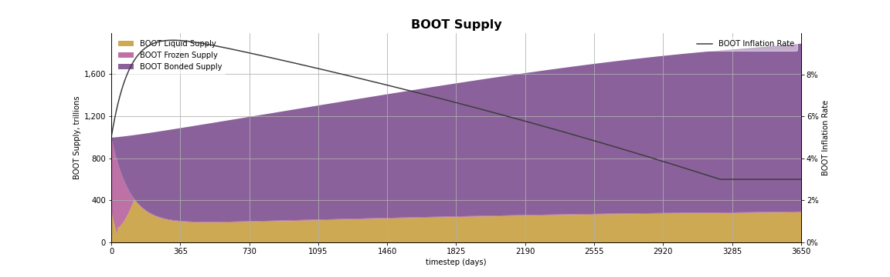

### Initial Values

- `boot_supply` `(1e15)`
- `boot_inflation_rate` `(0.05)`

### Simulation Parameters

- `boot_inflation_rate_max`  `(0.15)`
- `boot_inflation_rate_min`  `(0.03)`
- `boot_bonded_share_target` `(0.80)`
- `boot_inflation_rate_change_annual_annual`  `(0.20)`


## Modeling Bonded BOOT Amount (H Supply)

Agents (neurons) delegate liquid BOOT to heroes, and they mint corresponding amounts of Hydrogen (H).

<p style="text-align:center;"></p>

We model `boot_bonded_supply` using the next formula:

<p style="text-align:center;"></p>

where:

<p style="text-align:center;"></p>

We model neurons bonding behavior using parameters `boot_bonding_share_limit` `(0.85)` and `bonding_speed_coeff`
`(0.01)`, where `boot_bonding_share_limit` is the ratio between `boot_bonded_supply` and `boot_supply` which
neurons tend to have. And `bonding_speed_coeff` is the speed of bonding every timestep.

The one share of minted H tokens stays in the liquid state, another one is used for minting resource tokens (A
and V). `hydrogen_liquid_ratio` parameter is used in the current model which describes the token share allocated
to liquid H. The rest tokens are used for minting A and V in `hydrogen_liquid_ratio`.  

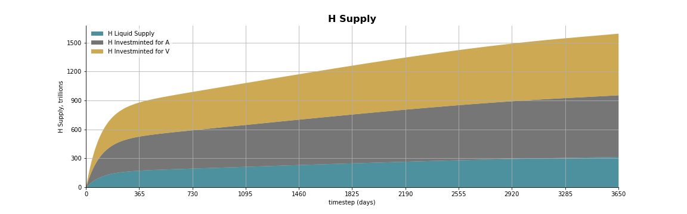

### Initial Values

- `boot_bonded_supply` `(10e12)`
- `hydrogen_supply` `(10e12)`

### Simulation Parameters

- `boot_bonding_share` `(0.8)`
- `hydrogen_liquid_ratio` `(0.2)`
- `boot_bonding_share_limit` `(0.85)`
- `bonding_speed_coeff` `(0.01)`
- `ampere_volt_ratio` `(0.5)`

## Gift Claim Dynamics

The addresses for gifts are defined in the [research](https://github.com/Snedashkovsky/cybergift). This research 
[concludes](https://github.com/Snedashkovsky/cybergift#prize-to-be-the-first) 6M addresses for distribution of 70% of 
BOOT tokens.

The `boot_claimed_supply` function has two phases:

- before `days_for_gift_activation`
- after `days_for_gift_activation`

It's expected that `claimed_at_activation_share` * `boot_gift_amount_init` amount of BOOTs will be reached in
`days_for_gift_activation`. After that, (1 - `claimed_at_activation_share`) * `boot_gift_amount_init` should be claimed
in `days_for_gift_full_claim`.

Therefore, the `boot_claimed_supply` function can be defined as linear function with condition:

<p style="text-align:center;"></p>

if `t` < `days_for_gift_activation`:

<p style="text-align:center;"></p>

if `t` = `days_for_gift_activation`

<p style="text-align:center;"></p>

if `t` > `days_for_gift_activation`:

<p style="text-align:center;"></p>


### `boot_to_distribution_supply`

In case where tokens have already been claimed but not transferred they change their state to “to_distribution” state 
(ready to be transferred to neurons). 


<p style="text-align:center;"></p>

### `boot_frozen_supply`

The `boot_frozen_supply` is defined as the token amount on the gift contract balance. 

<p style="text-align:center;"></p>

Therefore, the `delta_boot_frozen_supply` function can be represented in 3 phases:

if `t` < `days_for_gift_activation`:

<p style="text-align:center;"></p>

if `t` >= `days_for_gift_activation`:

<p style="text-align:center;"></p>

Assumptions:

- neurons (`agents_count_at_activation`) will claim our gift. After that the gift will be activated
- it will take `days_for_gift_activation` since genesis before the gift claiming process will be completed
- neurons on the moment of gift activation will claim share of the gift (`claimed_at_activation_share`)
- claim process can be prolonged on `days_for_gift_full_claim` in case if `agents_count_at_activation` will not
  reach the target goal by `days_for_gift_activation`

### Initial Values

- `boot_frozen_supply` `(700e12)`
- `boot_claimed_supply` `(0)`
- `boot_to_distribution_supply` `(0)`

### Simulation Parameters

- `days_for_gift_activation` `(30)`
- `claimed_at_activation_share` `(0.85)`
- `days_for_gift_full_claim` `(150)`
- `agents_count_at_activation` `(10'000, 50'000, 100'000)`
- `boot_gift_amount_init` `(700e12)`

## Understanding Network Effects

### Agents (Neurons) Growth

To model agents' growth dynamics of the Bostrom network, we did a regression analysis on ETH active addresses
dynamics ([excel spreadsheet online](https://needfordata-my.sharepoint.com/:x:/g/personal/max_needfordata_ru/EZWCgmE-VOBEsGJTg8lslpYBP2LQoBFdMC9LgXleJ3Dj_Q?e=PwmaIh)).
We calculated [ethereum active addresses](eth_active_agents.ipynb) as addresses with a balance more than 0.01 ETH
(the balance sufficient to complete at least 1 transaction).


We have combined 2 trend lines and derived the following formula of addresses counting by days from ETH dynamics.

<p style="text-align:center;"></p>

Assuming that there are much more crypto-agents now than there were at the time of ETH launch, we adjusted the
formula with coefficients to expect more rapid growth.

<p style="text-align:center;"></p>


### Capitalization Dynamics

We decided to model total `capitalization_in_eth` through `capitalization_per_agent` metric derived from ETH
capitalization in BTC (from the 100-th day from start till 2160 days of the network, as on the first 100 days ETH
price in BTC had a lot of fluctuations).

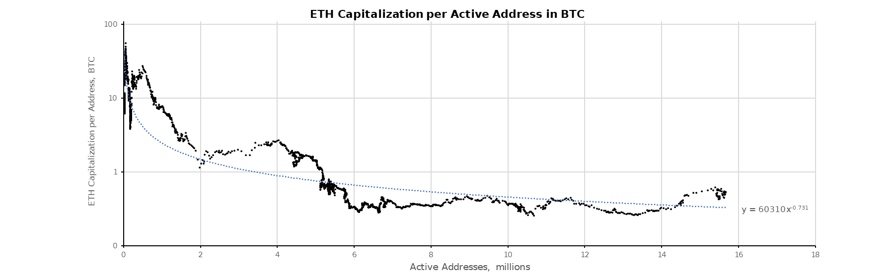

We derived such formula:

<p style="text-align:center;"></p>

We assumed that the dynamics of capitalization of BOOT token in ETH will resemble ETH token capitalization
dynamics in BTC prices. We adjusted the formula that our first-day `capitalization_per_agent` will be equal to 32
ETH (`capitalization_per_agent`).

<p style="text-align:center;"></p>

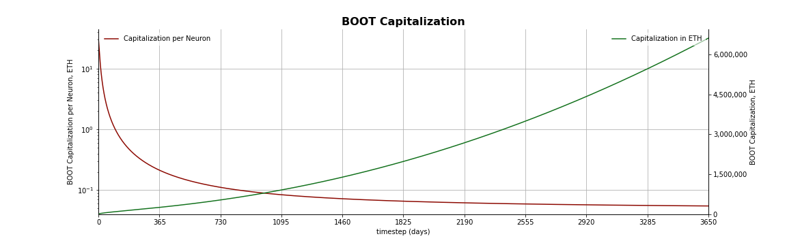

### Initial Values

- `capitalization_per_agent` `(32)`
- `agents_count` `(750)`

### Simulation Parameters

- `agents_count_at_activation` `(100'000)`


## Capitalization and Price

`capitalization_in_eth` in ETH is defined by the formula:

<p style="text-align:center;"></p>

`gboot_price` (Giga BOOT) price in ETH is defined by the formula:

<p style="text-align:center;"></p>

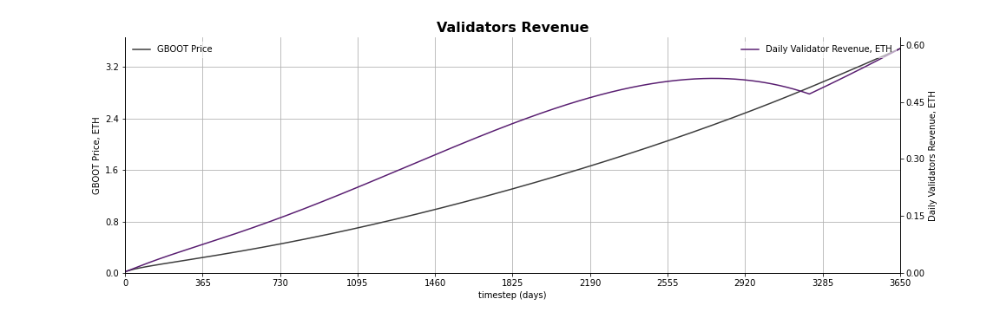

## Predicting V Demand

V are natural tokens. Each V enables its holder to produce 1 cyberlink daily. To simulate cyberlinks usage we
have derived base estimate of `cyberlinks_per_day` formula from ETH data:

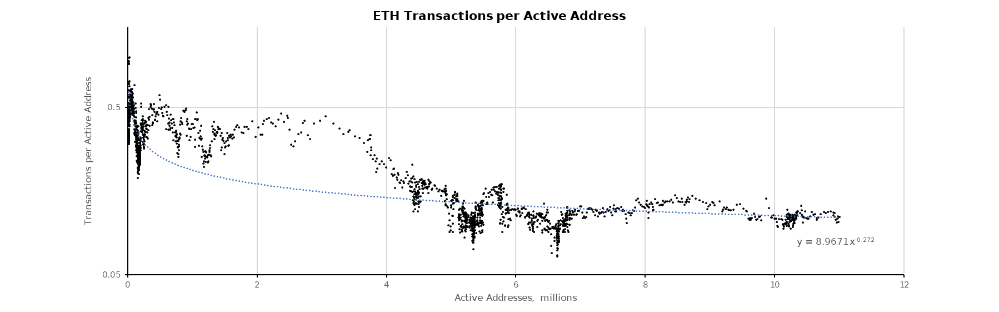

We derived such formula:

<p style="text-align:center;"></p>

And we adjusted such a formula by multiplication coefficient (`cyberlinks_trasactions_coeff`) because we expect
that neurons in the BOSTROM network will be more active than agents in ETH. Also, we adjusted such a formula by
adding a number of `extra_links` and `guaranteed_links`.

<p style="text-align:center;"></p>


**NOT IMPLEMENTED!!!**
`extra_links` count depends on UX specifics, such as setting the name of a neuron, following (proportion of
neurons) and extra:

<p style="text-align:center;">

Also, the founding team envisions some basic stuff to cyberlink such as naming systems and tokens. So we can rely
on this demand too. We left `guaranteed_links` count equal to 0 but it can be changed in the future.

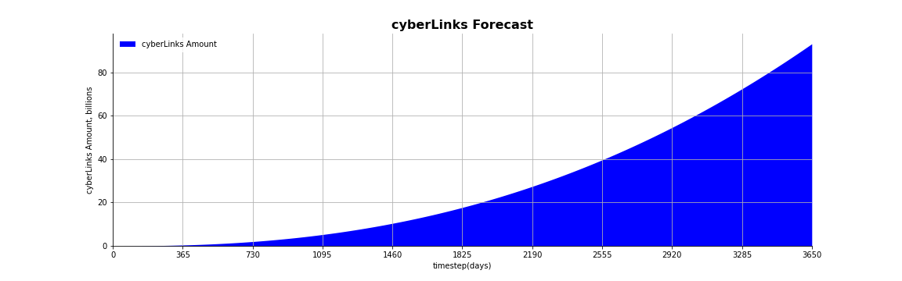

### Simulation Parameters

- `cyberlinks_trasactions_coeff` `(15)`
- `extra_links` `(0)`
- `guaranteed_links` `(0)`

## Adjusting A and V Supply

System designed in the way that investminted `volt_base_investmint_amount` for `volt_base_investmint_period`
yields 1 V.

System designed in the way that investminted `ampere_base_investmint_amount` for `ampere_base_investmint_period`
yields 1 A.

`ampere_base_investmint_period`, `volt_base_investmint_period` - are periods of investminting H token for the
selected token (A or V) by the current neuron. These periods are chosen by neurons themselves according to their
understanding and priorities of maximizing their benefits.

`ampere_base_investmint_period`, `volt_base_investmint_period` are limited by the `investmint_max_period` system
setting, which has the dynamic formula written below.

<p style="text-align:center;"></p>

Where `horizon_period_init` is the period before first `investmint_max_period` raise.

`ampere_base_halving_period`, `volt_base_halving_period` - time period to decrease mint_rate variable.

`ampere_mint_rate`, `volt_mint_rate` are coefficients that regulate the amount of minted resource tokens A and V.
They are set at the beginning and further these coefficients are halved each `ampere_base_halving_period`,
`volt_base_halving_period` accordingly.

<p style="text-align:center;"></p>


<p style="text-align:center;"></p>

`ampere_mint_rate`, `volt_mint_rate` are limited by - `ampere_mint_rate_min`, `volt_mint_rate_min` parameters.

As Ampere (A) are resource tokens, and they do not have natural measures we decided to model A supply equal to V.


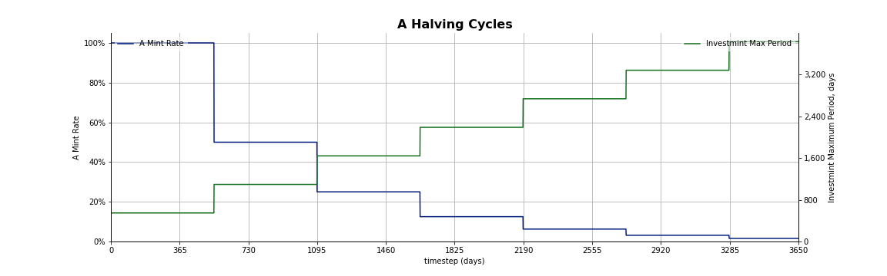
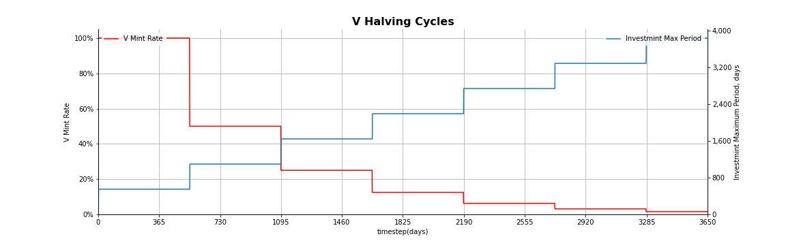


### Initial Values

- `ampere_mint_rate` `(1)`
- `volt_mint_rate` `(1)`
- `investmint_max_period` `(547)`


### Simulation Parameters

- `ampere_base_halving_period` `(547)`
- `volt_base_halving_period` `(547)`
- `ampere_mint_rate_min` `(0.01)`
- `volt_mint_rate_min` `(0.01)`
- `investmint_max_period_init` `(547)`
- `horizon_period_init` `(547)`

## A and V Minting

A are minted according to the following formula:

<p style="text-align:center;"></p>

V are minted according to the following formula:

<p style="text-align:center;"></p>

In the model it is implemented as:

<p style="text-align:center;"></p>

<p style="text-align:center;"></p>

<p style="text-align:center;"></p>

So we can rephrase formulas as:

<p style="text-align:center;"></p>

<p style="text-align:center;"></p>

We assume that `investmint_period_share` * `investmint_max_period` is an average period for investminting per neuron. 

`investmint_period_share` has stohastic function representation with u = 0.5, sigma = 0.1.

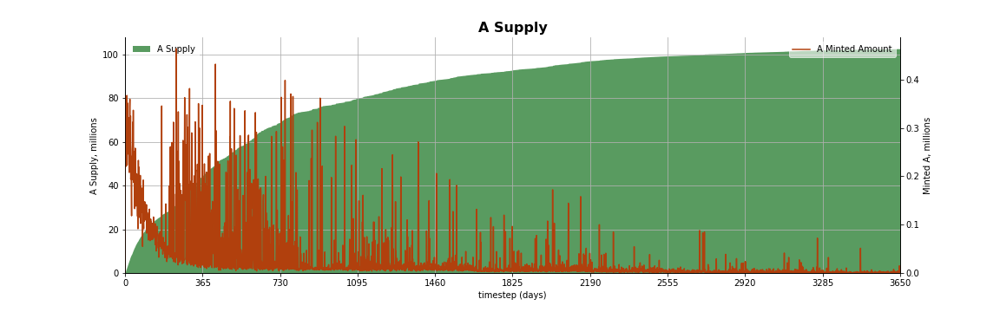
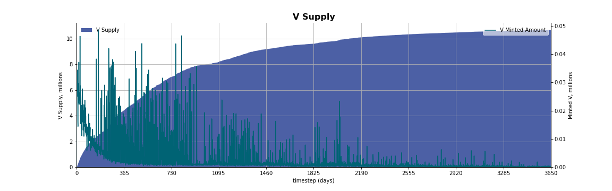

### Simulation Parameters

- `investmint_period_share` `(N(0.5, 0.01))`
- `ampere_volt_ratio` `(0.5)`
- `ampere_base_investmint_amount` `(100'000'000)`
- `volt_base_investmint_amount` `(1'000'000'000)`
- `ampere_base_investmint_period` `(30)`
- `volt_base_investmint_period` `(30)`


## Planing GPU Memory Usage

We had stress testing on the testnet to measure resources usage.

|                   | Bostrom Testnet 4 |      1B links |      100B links |
| :---------------- | ----------------: | ------------: | --------------: |
| Cyberlinks        |        40'335'720 | 1'000'000'000 | 100'000'000'000 |
| TPS               |                10 |            50 |             730 |
| GPU RAM Usage, GB |                 2 |            46 |           4'562 |
| GPU Time Usage, s |                35 |           900 |          90'000 |
| CPU RAM Usage, GB |                48 |         1'200 |         120'000 |
| CPU Time Usage, s |              0.10 |             2 |             250 |

The number of transactions per second is the main indicator of the load on the system. We have chosen to calculate this indicator taking into account only the number of cyberlinks. 

<p style="text-align:center;"></p>

According to stress testing measurements on testnet we derived formulas for GPU memory usage, CPU memory usage,
GPU time usage and CPU time usage:

<p style="text-align:center;"></p>

<p style="text-align:center;"></p>

<p style="text-align:center;"></p>

<p style="text-align:center;"></p>

where:

<p style="text-align:center;"></p>

The `particle_per_link` parameter defines amount of particles per cyberlink.


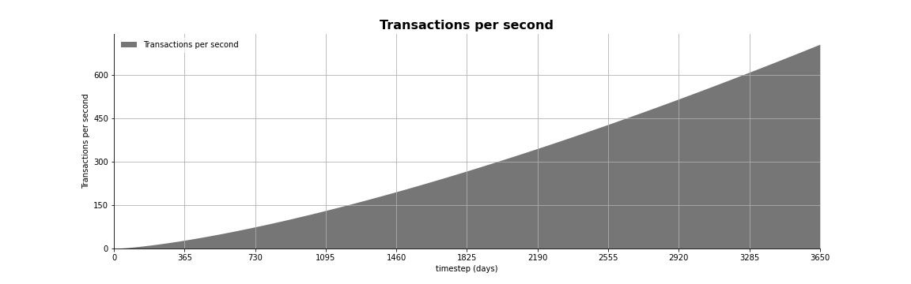
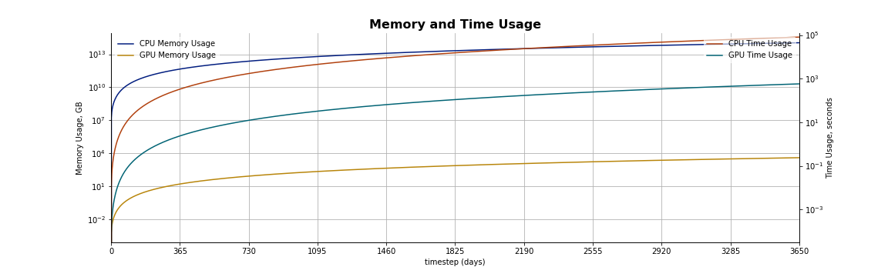

### Initial Values

- `gpu_memory_usage` `(0)`
- `cpu_memory_usage` `(0)`
- `cpu_time_usage` `(0)`
- `gpu_time_usage` `(0)`


### Simulation Parameters

- `particle_per_link` `(0.1)`


## Investments into Infrastructure

Further we can estimate revenue of 1 validator in ETH Equivalent, given that all validators have
commission (`validator_commission`) equals `validator_commission` and that there are `max_validator_count`
validators.

`validator_revenue_gboot` is defined by formula:

<p style="text-align:center;"></p>


### Simulation parameters

- `validator_commission` `(0.1)`
- `max_validator_count` `(92)`


## Mathematical Specification

### Initial Values

- `boot_supply` `(1e15)`
- `boot_inflation_rate` `(0.05)`

- `boot_bonded_supply` `(10e12)`
- `hydrogen_supply` `(10e12)`

- `boot_frozen_supply` `(700e12)`
- `boot_claimed_supply` `(0)`
- `boot_to_distribution_supply` `(0)`

- `capitalization_per_agent` `(32)`
- `agents_count` `(750)`

- `ampere_mint_rate` `(1)`
- `volt_mint_rate` `(1)`
- `investmint_max_period` `(547)`

- `gpu_memory_usage` `(0)`
- `cpu_memory_usage` `(0)`
- `cpu_time_usage` `(0)`
- `gpu_time_usage` `(0)`

### Summary of Simulation Parameters


- `timesteps_per_year` `(365)`
- `sim_period` `(10)`

- `boot_inflation_rate_max`  `(0.15)`
- `boot_inflation_rate_min`  `(0.03)`
- `boot_bonded_share_target` `(0.80)`
- `boot_inflation_rate_change_annual_annual`  `(0.20)`

- `boot_bonding_share` `(0.8)`
- `hydrogen_liquid_ratio` `(0.2)`
- `boot_bonding_share_limit` `(0.85)`
- `bonding_speed_coeff` `(0.01)`
- `ampere_volt_ratio` `(0.5)`

- `days_for_gift_activation` `(30)`
- `claimed_at_activation_share` `(0.85)`
- `days_for_gift_full_claim` `(150)`
- `agents_count_at_activation` `(100'000)`
- `boot_gift_amount_init` `(700e12)`

- `agents_count_at_activation` `(100'000)`

- `cyberlinks_trasactions_coeff` `(15)`
- `extra_links` `(0)`
- `guaranteed_links` `(0)`

- `ampere_base_halving_period` `(547)`
- `volt_base_halving_period` `(547)`
- `ampere_mint_rate_min` `(0.01)`
- `volt_mint_rate_min` `(0.01)`
- `investmint_max_period_init` `(547)`
- `horizon_period_init` `(547)`

- `investmint_period_share` `(N(0.5, 0.01))`
- `ampere_volt_ratio` `(0.5)`
- `ampere_base_investmint_amount` `(100'000'000)`
- `volt_base_investmint_amount` `(1'000'000'000)`
- `ampere_base_investmint_period` `(30)`
- `volt_base_investmint_period` `(30)`

- `particle_per_link` `(0.1)`

- `validator_commission` `(0.1)`
- `max_validator_count` `(92)`


### Formulas used as it is:

<p style="text-align:center;"></p>

<p style="text-align:center;"></p>

<p style="text-align:center;"></p>

<p style="text-align:center;"></p>

<p style="text-align:center;"></p>

<p style="text-align:center;"></p>

<p style="text-align:center;"></p>

<p style="text-align:center;"></p>

<p style="text-align:center;"></p>

<p style="text-align:center;"></p>

<p style="text-align:center;"></p>

where:

<p style="text-align:center;"></p>


### Formulas for Differential Equations: (Считаю эту секцию бесполезной! пока закомментировал)

<!-- <p style="text-align:center;"></p>

<p style="text-align:center;"></p>

<p style="text-align:center;"></p>

<p style="text-align:center;"></p>

<p style="text-align:center;"></p>

<p style="text-align:center;"></p>

<p style="text-align:center;"></p>

<p style="text-align:center;"></p>

<p style="text-align:center;"></p>

<p style="text-align:center;">

<p style="text-align:center;"></p>

<p style="text-align:center;"></p>

<p style="text-align:center;"></p> -->


### Differential Equations

- `boot_supply` - the supply of BOOT token
- `boot_inflation_rate` - inflation on timesep
- `boot_bonded_supply` - bonded (staked) network token amount (H Supply)
- `hydrogen_supply` - the supply of H token
- `hydrogen_liquid_supply` - liquid supply of H
- `boot_claimed_supply` - claimed from contract BOOT amount
- `boot_frozen_supply` - not claimed (frozen) network token amount
- `boot_liquid_supply` - liquid network token amount
- `boot_to_distribution_supply` - ready to transfer claimed BOOT amount
- `agents_count` - the amount of the active neurons
- `capitalization_per_agent` - the value of neuron in ETH
- `cyberlinks_count` - number of cyberlinks
- `ampere_supply` - A resource token amount
- `volt_supply` - V token amount

<p style="text-align:center;"></p>

<p style="text-align:center;"></p>

<p style="text-align:center;"></p>

<p style="text-align:center;"></p>

<p style="text-align:center;"></p>

<p style="text-align:center;"></p>

<p style="text-align:center;"></p>

<p style="text-align:center;"></p>

<p style="text-align:center;"></p>

<p style="text-align:center;"></p>

<p style="text-align:center;"></p>

<p style="text-align:center;"></p>

<p style="text-align:center;"></p>

<p style="text-align:center;"></p>


where the rate of change () is:

<p style="text-align:center;"></p>

<p style="text-align:center;"></p>

<p style="text-align:center;"></p>

<p style="text-align:center;"></p>

<p style="text-align:center;"></p>

<p style="text-align:center;"></p>

<p style="text-align:center;"></p>

<p style="text-align:center;"></p>

<p style="text-align:center;"></p>

<p style="text-align:center;"></p>

<p style="text-align:center;"></p>

<p style="text-align:center;"></p>

where:

<p style="text-align:center;"></p>

<p style="text-align:center;"></p>

<p style="text-align:center;"></p>

<p style="text-align:center;"></p>


## Conclusions


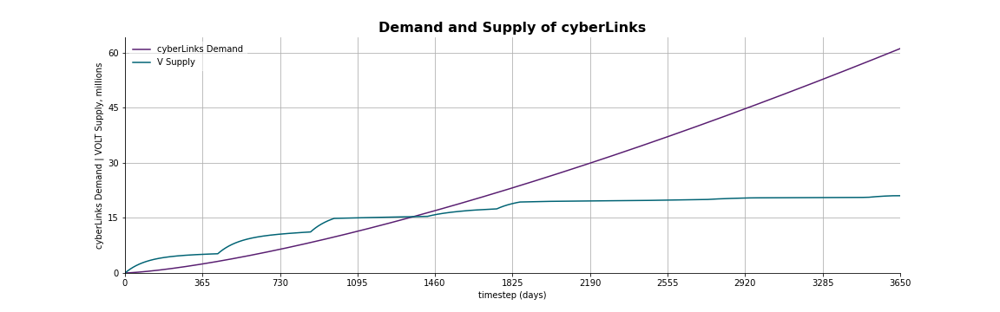
