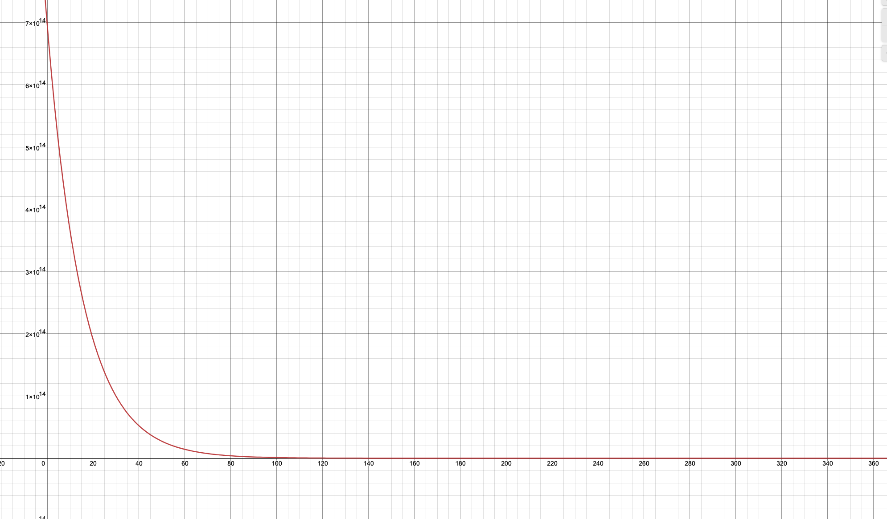

<!-- хаки рендеринга latex https://gist.github.com/a-rodin/fef3f543412d6e1ec5b6cf55bf197d7b#gistcomment-3523272 -->
# Bostrom network simulation

## Usage

0. Install Python3 if you have no
1. Go to `bostrom_simulation` folder
```bash
cd bostrom_simulation
```
2. Install requirements via pip3
```bash
pip3 install -r requirements.txt
```
3. Run
```bash
jupyter notebook
```
4. The notebook server should be running at `http://127.0.0.1:8888` 

5. Open [`simulation.ipynb`](simulation.ipynb)

6. Fill `Initial state` and `Params for simulating` sections

7. On the top bar `Kernel`->`Restart & Run All`

8. The simulation time depends on the simulation period you have set, f.e. for 7 years it approximately 1 hour

9. Look at the results and conclude.

## Goals

To optimize parameters for launching Bostrom.

An idea is to model the value of BOOT through the understanding of established network effects in Ethereum.
Then we can forecast claim dynamics and address growth based on approximated network effects. Assuming some demand for cyberlinks based on address growth we can adjust the supply of cyberlinks so that V price could grow. The given model also allows defining inflation parameters of BOOT to optimize investments into the hardware infrastructure.

## BOOT supply 

Simulate the ability of heroes to invest in infrastructure depending on different market conditions.  

The fomula is described in [Differential Equations](#differential-equations) section.

### Simulation parameters

- __*start_boot_supply*__ `(1e15)`
- __*boot_inflation_rate_change*__  
- __*boot_inflation_max*__  
- __*boot_inflation_min*__  
- __*boot_bonded_share_target*__  
- __*boot_supply*__  

## Gift claim dynamics
 
The addresses for gift are defined in the [research](https://github.com/Snedashkovsky/cybergift). This research [concludes](https://github.com/Snedashkovsky/cybergift#prize-to-be-the-first) 6M addresses for distribution of 70% of BOOT tokens. Further we need to model how this gifts can be claimed. 

We need to derive __*claim_rate*__ (by formula to define).

Assumptions:
- agents (__*start_agents_count*__) will claim our gift. After that the gift will be activated 
- it will take __*days_for_gift_activation*__ since genesis before the gift claiming process will be completed 
- agents on the moment of gift activation will claim share of the gift (__*claimed_at_activation_share*__)
- claim process can be prolonged on __*days_for_gift_full_claim*__ in case if __*start_agents_count*__ will not reach the target goal by __*days_for_gift_activation*__.
- __*liquid_boot_supply_share*__ - is share of BOOT supply that will be in circulation from the network launch

After the modeling of claim dynamics, we can set baselines for adoption ("understanding network effects" chapter).

### Simulation parameters

- __*start_agents_count*__ `(10'000, 50'000, 100'000)`
- __*days_for_gift_activation*__ `(100, 150)`
- __*days_for_gift_full_claim*__ `(0, 360)` 
- __*claimed_at_activation_share*__ `(1, 0.5)`
- __*liquid_boot_supply_share*__ `(0.25)`
- __*claimed_boot_supply*__ - ?

## Understanding network effects

Modeling price of BOOT as a function of usage weighted on network effects.  

To model agents' growth dynamics of the Bostrom network, we did a regression analysis on ETH active agent dynamics
([excel spreadsheet online](https://needfordata-my.sharepoint.com/:x:/g/personal/max_needfordata_ru/EZWCgmE-VOBEsGJTg8lslpYBP2LQoBFdMC9LgXleJ3Dj_Q?e=PwmaIh)).
We calculated [ethereum active agents](eth_active_agents.ipynb) as addresses with a balance more than 0.01 ETH (the
balance sufficient to complete at least 1 transaction).


We have combined 2 trendlines and derived the following formula of agents count by days from ETH dynamics.


Assuming that there are much more crypto-agents now than it was on  time of ETH launch we adjusted formula with
coeffients to expect more rapid growth.


We decided to model total capitalization through __*capitalization_per_agent*__ metric derived from ETH capitalization in
BTC (from 100 day from start till 2160 days of network, as before 100 days ETH price in BTC had a lot of fluctuations).


We derived such formula:


We assumed that dynamics of capitalization of BOOT token in ETH will resemble ETH token dynamics in BTC prices.
We adjusted the formula that our first day __*capitalization_per_agent*__ will be equal to 1 ETH
(__*start_capitalization_per_agent*__).


### Simulation parameters

- 
- __*start_capitalization_per_agent*__ `(1)`
- 

## Modeling H supply

Agents will delegate __*boot_bonded_share*__ (70%) of BOOT Supply to heroes, and H will be minted in the corresponding amount.


### Simulation parameters

- __*boot_bonded_share*__ `(0.7)`
- 

## Predicting V demand

Simulate cyberlinks usage.  

We have derived base estimate of cyberlink per agent formula from ETH data:


We derived such formula:


And we adjust such formula with the number of extra links and guaranteed links. 


*Extra_links*__ count depends on UX specifics, such as name setting, following (proportion of agents) and extra:

 

Also, the founding team envisions some basic stuff to cyberlink such as naming systems and tokens. So we can rely
on this demand also adding __*guaranteed_links*__ count.

### Simulation parameters 

- __*extra_links*__ - function to define
- __*guaranteed_links*__ - function to define
- 

## Adjusting V and A supply

To model minting properties of V for the planning of GPU storage and maximization of price. As A reource do not have natural measure we decide to model A supply rules equal to V. 

Gboot __*__ 1 day = 1 volt

__*investmint_period*__ - is period of investminiting H token for selected agent. It is choosen by agent according to his understanding and priorities of maximisation his benefits. 


And it is limited by system setting of __*investmint_max_period*__, that has some dynamic formula to define and research (presumably it will become longer with the age of network - [3, 6, 9, 12 ... ] monthes but no longer than the time from network start). 
- __*investmint_amount*__ - is amount of H token investminted by agents for selected period of time.  
- __*halving_time*__ - time period to increase investmint amount twofold.
- __*a_v_proportion*__ - ?

### Simulation parameteres

Parameters to define for V and A:
- __*base_investmint_period*__  
- __*base_investmint_amount*__  
- __*start_investmint_max_period*__ `(90)`  
- __*horizont_step*__ 
- __*halving_time*__
- __*a_v_proportion*__ `(0.5)`  

## Subtotal summary of simulation parameters

- __*start_boot_supply*__ = `1e15`
- 
- __*boot_inflation_rate_change*__  
- __*boot_inflation_max*__  
- __*boot_inflation_min*__  
- __*boot_bonded_share_target*__  
- __*start_agents_count*__ `(10'000, 50'000, 100'000)`
- __*days_for_gift_activation*__ `(30, 100)`
- 
- 
- 
- __*boot_bonded_share*__ = `0.7`
- 
- __*extra_links*__ - function to define
- __*guaranteed_links*__ - function to define
- 
- __*investmint_period*__  
- __*investmint_amount*__  
- __*halving_time*__  
- __*investmint_max_period*__  
- __*a_v_proportion*__  

## Investments into infrastructure

BOOT Supply
BOOT Staked
Comission = 10%
BOOT price
Validator count = 92

Target - revenue of 1 validator

## Further work

Model could work as prediction governance tool for working network based on acutal measurements.


## Legend

There are three network tokens:

-  F - Unclaimed network token
-  T - Liquid network token
-  L - Frozen network token


and two resource tokens:

-  A - Amper token
-  V - Volt token

The initial state of all tokens should be defined below

-  1 __**timestep**__ == 1 time unit

## Claim function

The function of claim frozen tokens is:




where __**x**__ is year. This function means 80% of frozen tokens are going to be claimed in 3 years linearly by ~187
TeraTokens per year

## Vesting and Unvesting

The vesting function is defined as the amount of locking tokens in the time unit assumed by all liquid tokens must be
locked in the lock timeframe.

The vesting function is defined as the amount of unlocking tokens in the time unit assumed by all locked tokens must
be unlocked in the unlock timeframe.

## Resource tokens

Amperes and Volts mints by the following formula:


where: 
-  __**x**__ is number of vested tokens
-  __**lockTime**__ is the maximum time for locking tokens
-  __**cycle**__ is amount of blocks for rank and entropy calculation
-  __**initPrice**__ is the initial price of the minting
-  __**MR_r**__ is mint rate [100, 1]. It's different for all energy tokens


## Mint Rate (Amperes)

Mint rate is multiple coefficient for minting Amper tokens

It is halving every year


where: 
-  __**x**__ is year
-  __**initMRa**__ is the initial value of MRa

f.e.


## Mint Rate (Voltes)

Mint rate is multiple coefficient for minting Volt tokens

It is halving every amount of supply defined


where: 
-  __**x**__ is defined supply
-  __**initMRv**__ is the initial value of MRv


## Inflation

The inflation function depends on the ratio between vested tokens and tokens supply. It the same as in cosmos-based
networks.

## Supply

Supply is the sum of liquid, vested and frozen tokens in each block.


## Utils

The function of using volts for cyberlinking. By the simulation the probability in a timestamp [0.01, 0.02, 0.03, 0.05, 0.08, 0.13, 0.21, 0.34] .


## Assumptions

1. All agents lock tokens for the maximum available period defined in params for simulating
2. All agents mint maximum __**A**__ and __**V**__ tokens in 50/50 ratio

## Mathematical Specification

### Differential Equations

-  T - liquid network token
-  L - locked(vested) network token
-  F - not claimed(frozen) network token
-  IRC_u - inflation rate change per time unit
-  S - total network tokens supply
-  I - inflation per time unit in network tokens
-  Provision - per time unit token provision
-  A - Amper token
-  V - Volt token
-  CL - cyberlinks
-  Agents_count - the amount of the active agents
-  

  
  
  
  
  
  
  
  
  
  

where the rate of change () is:  

  
  
  
  
  
  
  
  
  
  

where:

  
  
  